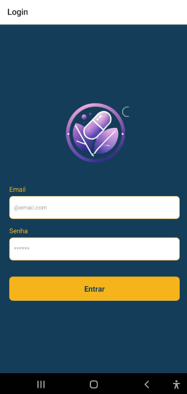
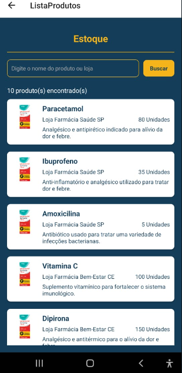
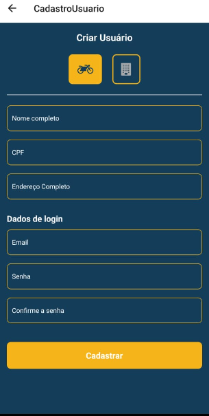

# Sistema de Gestão de Movimentações - ProjetoModuloClamed

## Descrição

**ProjetoModuloClamed** é um sistema desenvolvido para gerenciar e rastrear a movimentação de produtos entre filiais. Voltado para empresas com múltiplas unidades, o sistema permite o controle de transferências de estoque entre diferentes localidades, oferecendo visibilidade e monitoramento do processo de entrega, desde a criação até a finalização.

## Problema Resolvido

A transferência de produtos entre filiais pode ser um processo complexo, especialmente quando há pouca visibilidade do status da movimentação. **ProjetoModuloClamed** soluciona esse problema ao:
- Controlar o estoque e monitorar a movimentação dos produtos.
- Registrar o histórico de cada movimentação, com atualizações de status e captura de evidências (fotos).
- Facilitar o acesso e gestão das transferências, garantindo maior transparência no processo.

## Tecnologias Utilizadas

O desenvolvimento do sistema contou com diversas tecnologias modernas, garantindo escalabilidade, segurança e uma interface amigável:

### Backend disponibilizado pelo professor 
- **Node.js** e **Express** para a construção de APIs RESTful.
- **SQLite** como banco de dados, garantindo um armazenamento rápido e eficiente.
- **Multer** para upload de arquivos (imagens).
- **JWT** (JSON Web Tokens) para autenticação.

### Frontend
- **React Native** para a criação de uma interface mobile nativa e responsiva.
- **Axios** para comunicação com o backend.
- **Expo** para gerenciar o ambiente de desenvolvimento.

### Outras Ferramentas
- **Git** e **GitHub** para controle de versão e gerenciamento de código.
- **Expo ImagePicker** para acessar a câmera do dispositivo e capturar imagens.

## Estrutura do Projeto

- **/src**: Contém todo o código fonte do aplicativo React Native.
  - **/components**: Componentes reutilizáveis.
  - **/screens**: Telas do aplicativo, como login, listagem de movimentações, cadastro de movimentações, e mapa.


## Funcionalidades

1. **Autenticação de Usuários**: Login e senha para autenticação do usuário
2. **Cadastro e Listagem de Movimentações**: Permite criar, visualizar e atualizar movimentações de produtos.
3. **Atualização de Status e Upload de Imagens**: Motoristas podem iniciar e finalizar entregas com captura de fotos, registradas como evidências.


## Como Executar

### Pré-requisitos
- **Node.js** e **npm** instalados.
- **Expo CLI** instalado globalmente.
- **Git** para clonar o repositório.

### Passo a Passo

1. **Clone o repositório**:
   ```bash
   git clone https://github.com/alexandrooliveira87/ProjetoModuloClamed.git
  
2. npm install

3. expo start

4. Execução:

Abra o app no simulador ou no seu dispositivo físico usando o QR code gerado pelo Expo.

**Melhoria Futuras**

1. Sistema de notificações para alertar sobre movimentações pendentes ou atualizações.
2. Exportação de relatórios sobre movimentações e histórico de transferências.
3. criação dos perfis dos usuários
4. Implementações dos mapas.

Imagens do projeto






